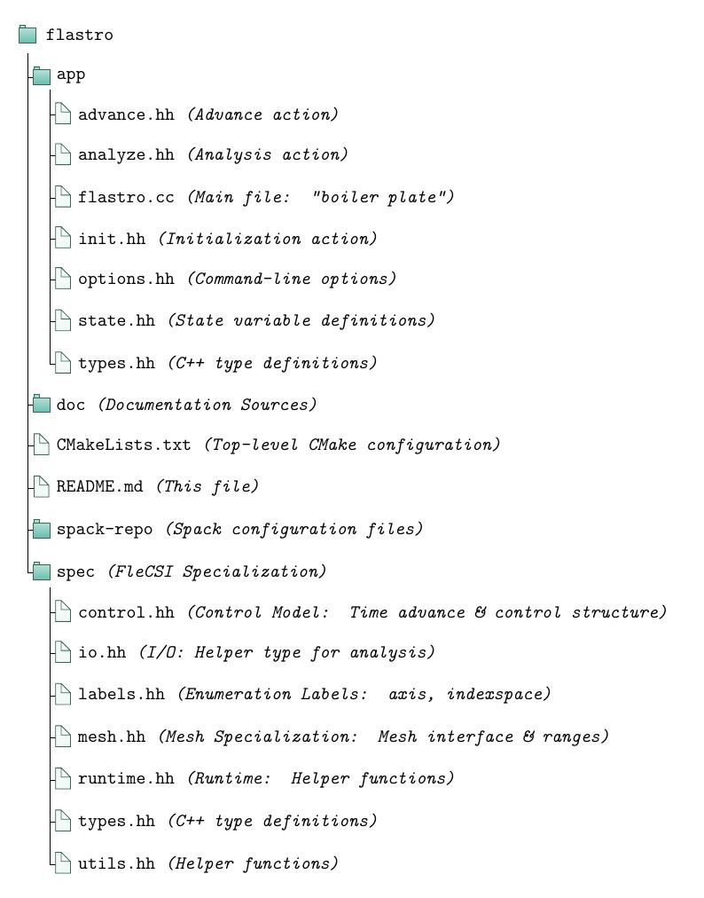

# FlAstro

FlAstro is a radiation-hydrodynamics solver suite for the study of
astrophysical phenomena. To start using FlAstro take a look at the
[documentation](http://cdss24.pages.lanl.gov/flastro). For a quick start
to building FlAstro, follow the steps below.

# Spack

The easiast way to build FlAstro is to use *spack*:

Clone the spack repo and initialize:
```
$ git clone git@github.com:spack/spack.git $HOME/.spack
$ source $HOME/.spack/share/spack/setup-env.sh
```

You can automate your spack setup by adding something like this to your
`$HOME/.bashrc` file:
```
# Setup spack environment
[ -f $HOME/.spack/share/spack/setup-env.sh ] && \
. $HOME/.spack/share/spack/setup-env.sh

export SPACK_EDITOR=vi
```
Notice that this also sets the *SPACK_EDITOR* environment variable. This
is useful for selecting the editor program spack will use for various
interface operations (used below).

Next, create a spack *environment* for FlAstro and activate it:
```
$ spack env create flastro
$ spacktivate flastro
```

Once you are in the *flastro* environment, you need to edit the
environment config and replace the contents with the following, where
*PATH-TO-FLASTRO-CLONE* is the path to your clone of FlAstro:
```
spack:
  specs:
  - flecsi@2.3-cdss+flog+graphviz++hdf5++kokkos backend=legion
    build_type=Debug caliper_detail=medium ^legion network=gasnet conduit=mpi
  - graphviz+libgd
  - yaml-cpp
  view: true
  concretizer:
    unify: true
  repos:
  - /PATH-TO-FLASTRO-CLONE/spack-repo
```

To edit the environment config, execute the following, which will open
an editor session (you can cut and paste the replacement contents
from above):
```
$ spack config edit
```
**Note: You must be in an activated spack environment for this to
work.**

Save and quit your editor session. The next step is to *concretize* the
new environment. Concretization solves an optimization problem that
takes all of the package dependencies in an environment and reconciles
version and subdependency compatibility:
```
$ spack concretize -f
```
The `-f` operation forces spack to re-concretize, which is not necessary
for a new, unconcretized environment. However, it doesn't hurt, and it
is useful in most invocations to insure that spack is using the most
up-to-date config information.

To finish up the spack portion of the build, we just need to *install*
the packages:
```
$ spack install
```
This will fetch all of the FlAstro dependencies and build them in your
local spack tree (under *$HOME/.spack/opt* to be precise). This step
will take some time.

# Build

Now that we have setup our spack environment, the rest of the build is
really easy. First, change directory into your FlAstro clone and create
a build directory:
```
$ cd PATH-TO-FLASTRO-CLONE
$ mkdir build
```
Next, change directory into the build directory and run *cmake*:
```
$ cd build
$ cmake ..
```
This will configure your build with the default settings for FlAstro.
When cmake has completed, simply run make:
```
$ make
```

# Source Layout

The source code for FlAstro has the following structure (some files and
directories are omitted):



<!-- vim: set tabstop=2 shiftwidth=2 expandtab fo=cqt tw=72 : -->
