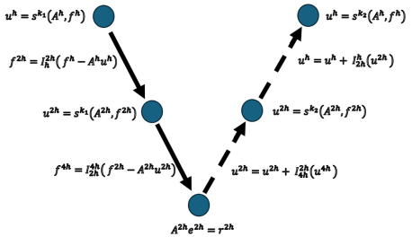
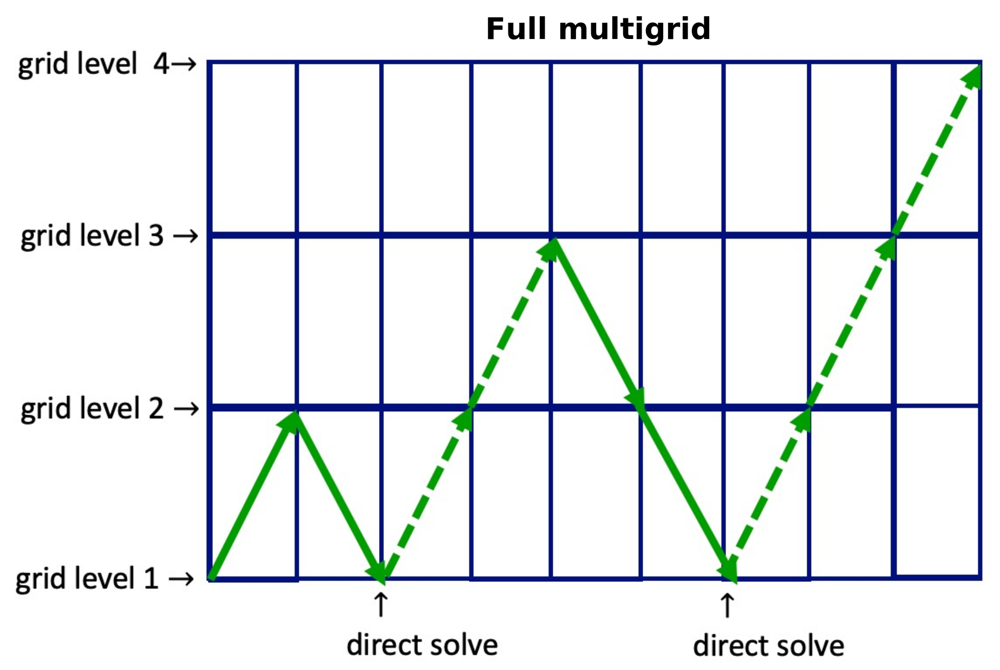

.. |br| raw:: html

    

.. _hard_method:

Numerical Schemes
*****************

MUSCL Scheme
~~~~~~~~~~~~

The MUSCL scheme (*Monotonic Upstream-centered Scheme for Conservation
Laws*) is a second-order in space finite volume method that is *total
variation diminishing (TVD)* and can provide accurate simulations of
shock dynamics. A succinct, semi-discrete representation of the scheme
can be written

.. math::

   \frac{du_i}{dt} + \frac{1}{\Delta x_i}
   \left[
     F^{*}_{i+1/2} - F^{*}_{i-1/2}
   \right] = 0,\label{semi}\tag{1}

where :math:`F^{*}_{i\pm 1/2}` are numerical fluxes that are a
non-linear mix of first and second-order slope reconstructions depending
on the gradients close to the current cell, and can be written in the
form

.. math::

   F^{*}_{i\pm 1/2} = f^{low}_{i\pm 1/2} -
   \phi(r_i)
   \left(
     f^{low}_{i\pm 1/2} - f^{high}_{i\pm 1/2}
   \right)

where :math:`r_i` is the ratio of successive gradient approximations and
:math:`\phi: r_i \rightarrow [0,1]` is a limiter function that selects a
realistic spatial derivative value. One example of such a limiter
function is the *minmod* limiter

.. math::

   \phi_{mm}(r_i) = max[0, min(1,r_i)];
   \;\;\lim_{r_i \rightarrow \infty}\phi_{mm}(r_i) = 1.

In smooth areas of the flow, :math:`\phi_{mm}(r_i)` will be close to
one, which will select the higher-order approximation. Near a shock,
:math:`r_i` will approach infinity and :math:`\phi_{mm}(r_i)` will be
close to zero and the low-order approximation will be selected.

Hancock Time Evolution
~~~~~~~~~~~~~~~~~~~~~~

To fully discretize (:math:`\ref{semi}`), we can use the Hancock method
to approximate the time derivative. This method is second-order accurate
in time. The Hancock discretization is a predictor-corrector method that
uses the averages of the reconstructed input quantities to approximate
the flux for :math:`t+\Delta t/2` in the predictor step. These
intermediate quantities are then reconstructed to the faces again, but a
*Riemann* solver is used to compute the corrector step.

.. note::

   The MUSCL-Hancock method documented here is second-order accurate in
   space and time.

The quantity reconstruction to faces uses the rule

.. math::

   q^n_{i\pm 1/2} = q^n_i \pm
     \frac{\Delta x_i}{2}
     \left(\frac{\partial q^n_i}{\partial s}\right),\label{recon}\tag{2}

where :math:`\partial q^n_i/\partial s` is the flux limited slope.

The predictor step computes intermediate quantities :math:`q^{*}` using

.. math::

   q^{*}_i = q^n_i - \frac{\Delta t}{2\Delta x_i}
   \left(q^n_{i-1/2} - q^n_{i+1/2}\right).

These quantities are then reconstructed to the faces again by applying
(:math:`\ref{recon}`). The corrector step is

.. math::

   q^{n+1}_i = q^n_i + \frac{\Delta t}{\Delta x}
   \left( F_{i-1/2} - F_{i+1/2} \right),

where the :math:`F_i\pm1/2` are obtained from a Riemann solver. The code
in this specialization example uses the HLL approximate Riemann sovler.

.. math::

   F^{hll} =
   \frac
   {S_R F_L - S_L F_R + S_R S_L\left(U_R - U_L\right)}
   {S_R - S_L}

where :math:`S_T` and :math:`S_H` are the min and max characteristic
speeds taken at the tail and head of the cell interfaces respectively,
:math:`U_L` and :math:`U_R` are the respective intermediate quantities,
and :math:`F_L` and :math:`F_R` are the flux functions evaluated at the
respective intermediate quantities.

Runge-Kutta Time Evolution for Explicit Update
~~~~~~~~~~~~~~~~~~~~~~~~~~~~~~~~~~~~~~~~~~~~~~~

Geometric Multigrid Solver for Implicit Update
~~~~~~~~~~~~~~~~~~~~~~~~~~~~~~~~~~~~~~~~~~~~~~~

A geometric multigrid solver is a linear solver that uses the fact that
relaxation methods such as the Jacobi or the Gauss-Seidel method
converge faster in coarser domains or grids, and then the solutions in
those coarser grids can be used as initial guesses of the relaxation
methods applied in finer grids.

The method begins by applying a relaxation method to the system

.. math::

  Ax = b.

After a few iterations of the relaxation method we obtain the
approximate solution :math:`x'`. The residual :math:`r` is then computed
with :math:`r = b - Ax'`. This gives raise to the equation :math:`Ay =
r`, such that :math:`y` is a correction to the unkown array :math:`x`
and the improved approximation :math:`x''` is given by

.. math::

  x'' = x' + y \implies Ax'' = A(x' + y) = Ax' + r = b,\label{residual}\tag{3}

which only works if the operator :math:`A` is linear.

To solve :math:`Ay = r`, the equation can be transported to a coarser
grid where relaxation methods are more effective. This is done by
applying a restriction operator on :math:`r \rightarrow r_c`. In the
coarser grid, the system :math:`Ay_c = r_c` is solved by applying the
method described above, with an initial solution of :math:`y_{c0} = 0`.

Once obtained, the solution :math:`y_c` is extended with a prolongation
operator to the finer grid, where the correction
(:math:`\ref{residual}`) is applied. In the coarsest level an exact
solution to the system is ideally calculated, but an approximated
solution can be used as well.

The algorithm described above is named `v-cycle` due to its diagram:

A full multigrid (`FMG`) is the chaining of successive such `v-cycles`
where a finer grid is added after each `v-cycle` is completed:

.. vim: set tabstop=2 shiftwidth=2 expandtab fo=cqt tw=72 :
